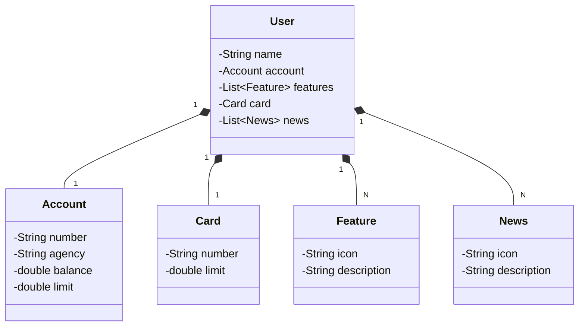

# <h1 align="center"> Desafio: Lab Publicando Sua API REST na Nuvem Usando Spring Boot 3 e Java 17</h1>
Este repositório reúne os principais aprendizados adquiridos durante o **Bootcamp GFT - Desenvolvimento Java com IA - Curso: Banco de Dados, Padrões de Projeto e APIs com Spring Boot** da plataforma DIO.me. 
Este projeto foi desenvolvido como parte do desafio da Digital Innovation One (DIO), com o objetivo de aplicar os principais padrões de projeto na construção de uma API REST moderna utilizando **Java 17** e **Spring Boot 3**, aplicando boas práticas de arquitetura, documentação e persistência de dados.

---

##  Sobre o Desafio
O desafio proposto é uma iniciativa educacional que conecta desenvolvedores com o mercado financeiro, promovendo capacitação prática com tecnologias modernas. 
Não cheguei a fazer o deploy na nuvem, mas assim que o fizer, atualizo o repostório!

O projeto simula uma API de uma conta bancária simples com recursos como:
- Cartões do Cliente
- Notícias
- Feature
- Usuários

##  Tecnologias Utilizadas

- **Java 17**
- **Spring Boot 3**
- **Spring Data JPA**
- **H2 Database** (ambiente de desenvolvimento)
- **PostgreSQL** (ambiente de produção)
- **Springdoc OpenAPI (Swagger UI)** – documentação interativa
- **Gradle** – gerenciamento de dependências
- **IntelliJ IDEA** – ambiente de desenvolvimento
- **Railway** – deploy na nuvem (opcional)

##  Criação do Projeto
O projeto foi gerado via [Spring Initializr](https://start.spring.io/) com as seguintes dependências:

- Spring Web
- Spring Data JPA
- PostgreSQL Driver
- H2 Database
- Spring Boot DevTools
- Spring Boot Test

##  Diagrama de Classes



##  Banco de Dados

Durante o desenvolvimento, foi utilizado o **H2 Database**, um banco em memória leve e de fácil visualização via console:

- Console: `http://localhost:8080/h2-console`
- JDBC URL: `jdbc:h2:mem:sdw2025`
- Usuário: `sdw2025`
- Senha: *(em branco)*

Para produção, o projeto está preparado para uso com **PostgreSQL**, com configuração via `application-prod.yml`.

##  Documentação da API

A documentação interativa da API é gerada automaticamente com **Swagger UI**:

- Acesse: `http://localhost:8080/swagger-ui/index.html`
- Endpoint da especificação: `/v3/api-docs`

##  Estrutura do Projeto

```
src/
├── main/ │
├── java/me.dio/
│ │ ├── controller/
| |     └── exception/
│ │ ├── domain/
│ │     └── model/ 
| |     └── repository/
│ │ ├── service/
│ │     └── impl/
│ └── resources/
│   ├── application.dev.yml
│   └── data.sql (opcional)
```

##  Funcionalidades

- Cadastro de usuários com validação de número de conta
- Consulta de usuário por ID
- Tratamento global de exceções com `@RestControllerAdvice`
- Documentação automática com Swagger
- Deploy preparado para ambientes como Railway

##  Testes
Os testes são executados com JUnit 5 e Spring Boot Starter Test:
```bash
./gradlew test
```
##  Deploy
O projeto pode ser facilmente publicado na nuvem com Railway, utilizando o Procfile já incluído:

```
web: java -jar build/libs/santander-dev-week-2025-0.0.1-SNAPSHOT.jar
```

##  Desenvolvedora
Izaura TM - responsável pelo projeto.

##  Contribuições
Sinta-se à vontade para abrir issues ou enviar pull requests com melhorias, sugestões ou novas funcionalidades!

> Este conteúdo faz parte do projeto **Publicando Sua API REST na Nuvem Usando Spring Boot 3, Java 17 e Railway - Laboratório** da plataforma DIO.me.

---

 ##  Links de Referência:  
- [Spring Initializr](https://start.spring.io/index.html)
- [Configurações do Projeto](https://start.spring.io/#!type=gradle-project&language=java&platformVersion=3.5.6&packaging=jar&jvmVersion=17&groupId=me.dio&artifactId=santander-dev-week-2025&name=santander-dev-week-2025&description=Java%20RESTful%20API%20criada%20para%20Santander%20Dev%20Week%202025&packageName=me.dio.santander-dev-week-2025&dependencies=web,data-jpa,h2,postgresql)
- [Mermaid - Ferramenta de Diagramação e Gráficos](https://mermaid.js.org)
- [Swagger Editor](https://editor.swagger.io/)
- [IntelliJ IDEA](https://www.jetbrains.com/pt-br/idea/)
- [JSON Editor online](https://jsoneditoronline.org/#left=local.posuha&right=local.tafayu)
- [Railway](https://railway.com/)
- [Github com documentação: Biblioteca springdoc-openapi](https://github.com/springdoc/springdoc-openapi)
- [Java-Oracle: Downloads](https://www.oracle.com/br/java/technologies/downloads/)
- [Flaticon](https://www.flaticon.com/)

📎 Link do curso: [DIO.me](https://web.dio.me/home) 


